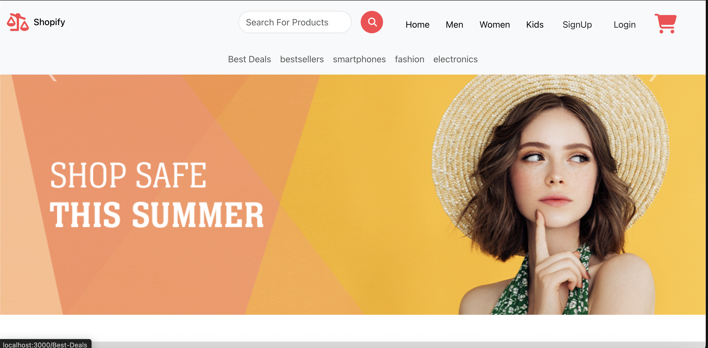
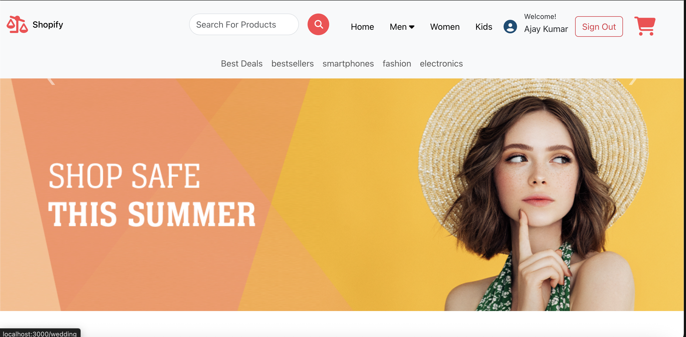
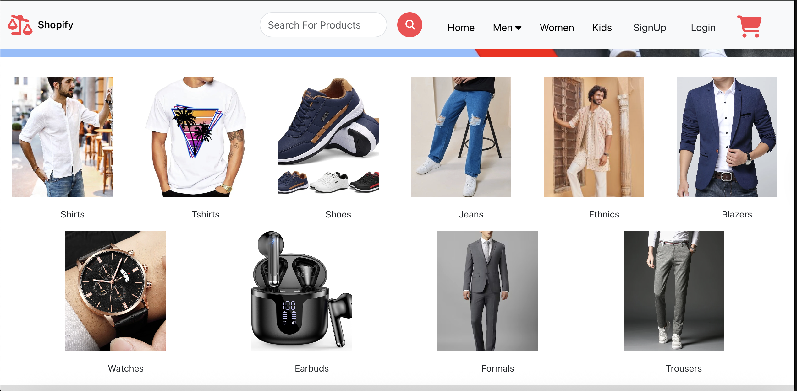
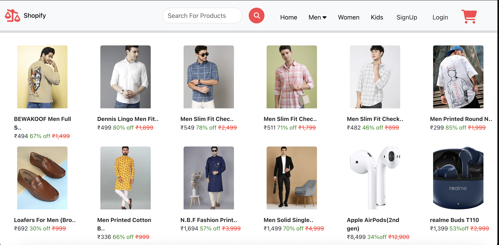
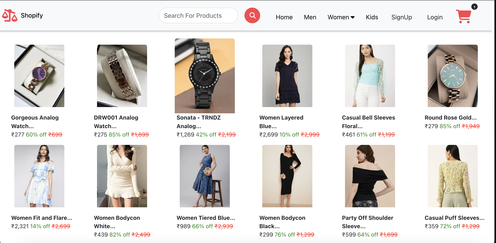
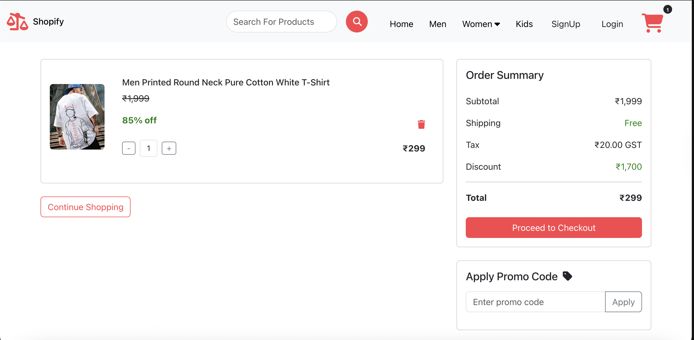
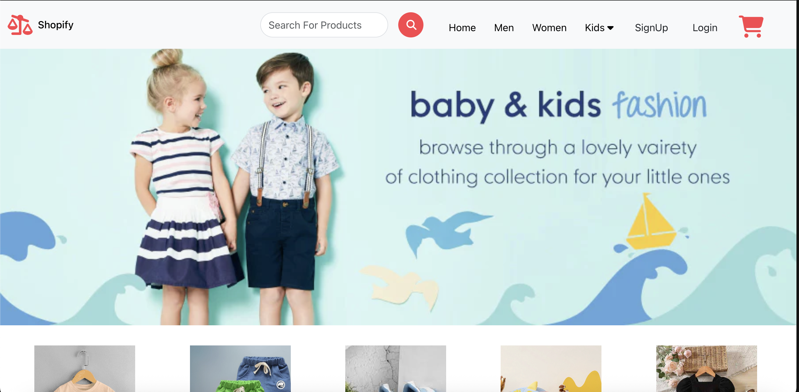
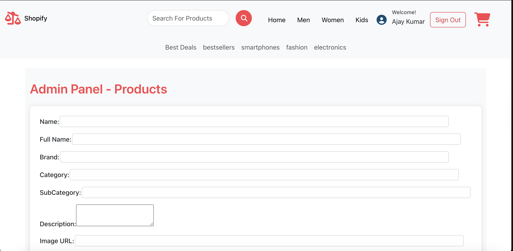
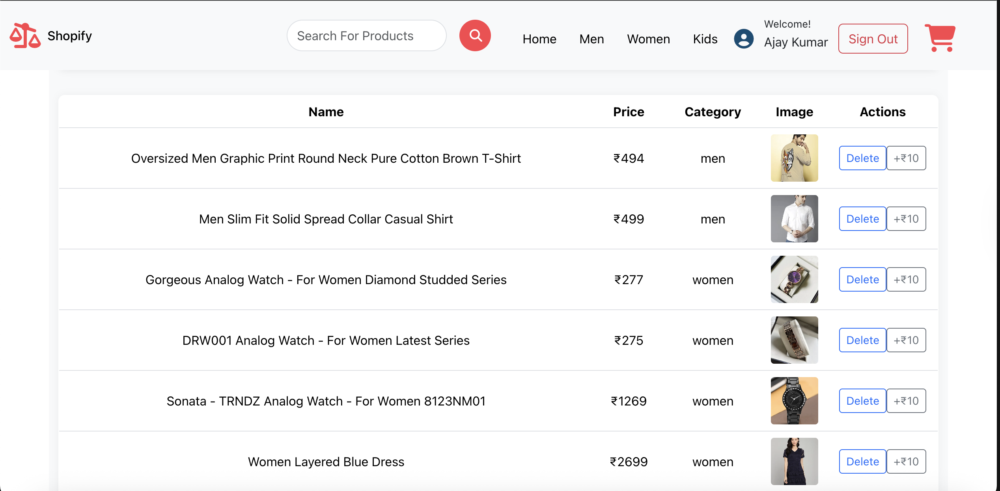

# 🛍️ MERN E-Commerce Website  


---

## 📖 Overview
A full-stack **MERN E-Commerce Website** built to provide a seamless shopping experience.  
This project started as a frontend-only application during my internship and has now evolved into a **fully functional MERN stack website** with real-world features like authentication, cart system, and admin controls.  

---

## 🚀 Tech Stack
| Layer | Technology |
|-------|-------------|
| **Frontend** | React.js, Bootstrap |
| **Backend** | Node.js, Express.js |
| **Database** | MongoDB (Atlas) |
| **Authentication** | JWT (JSON Web Token) |
| **State Management** | Context API |
| **Payment Gateway (Upcoming)** | Stripe / Razorpay |
| **Hosting (Planned)** | Render / Vercel / Railway |

---

## 🌟 Core Features
### ✅ Completed
- 🔐 **User Authentication & Authorization**
  - JWT-based login/register system  
  - Secure password hashing (bcrypt)  
  - Role-based access (Admin, User)  

- 🛒 **Product Management**
  - Admin can add, edit, and delete products  
  - Users can view, search, sort, and filter products  

- 🧺 **Shopping Cart & Checkout**
  - Add to cart, remove, and update quantity  
  - Checkout with order summary and shipping info  

### 🔜 Upcoming Advancements
- 💳 **Payment Integration**
  - Stripe, Razorpay, or PayPal sandbox  

- 📦 **Order Tracking**
  - Real-time order status updates: *Pending → Shipped → Delivered*  

---

## 🧩 Folder Structure
```
ecommerce-mern/
│
├── backend/
│ ├── config/ # DB connection & environment setup
│ ├── controllers/ # Business logic
│ ├── models/ # Mongoose schemas
│ ├── routes/ # API routes
│ ├── middleware/ # Auth middleware
│ └── server.js # Entry point
│
├── frontend/
│ ├── src/
│ │ ├── components/ # Reusable components
│ │ ├── pages/ # UI pages (Home, Product, Cart, etc.)
│ │ ├── context/ # Context API for state management
│ │ └── App.js
│ └── package.json
│
└── README.md
```


---

## 🧠 Learning Highlights
- Implemented **JWT Authentication** for secure access  
- Built reusable **React components** with Bootstrap styling  
- Designed **RESTful APIs** using Express.js  
- Managed **state efficiently** with Context API  
- Understood **end-to-end integration** of frontend and backend  

---

## ⚙️ Installation & Setup
```bash
# Clone the repo
git clone https://github.com/<your-username>/<repo-name>.git

# Install backend dependencies
cd backend
npm install

# Create a .env file in backend with:
MONGO_URI=your_mongodb_connection_string
JWT_SECRET=your_secret_key
PORT=5000

# Run backend server
npm start

# Install frontend dependencies
cd ../frontend
npm install

# Run frontend
npm start
```
## 🖥️ Screenshots











# 🚧 Future Enhancements

💬 AI-powered shopping assistant chatbot

🧠 Product recommendation system (ML-based)

🌐 PWA version (installable web app)

📊 Admin analytics dashboard

# 🤝 Contributing

Contributions, issues, and feature requests are welcome!
Feel free to fork this repo and submit a pull request.

# 📜 License

This project is licensed under the MIT License.

# 👨‍💻 Author

Ajay Kumar Prasad
2nd-year B.Tech CSE @ NIT Andhra Pradesh
🌐 GitHub
 • 💼 LinkedIn

⭐ If you like this project, don't forget to star the repo! ⭐